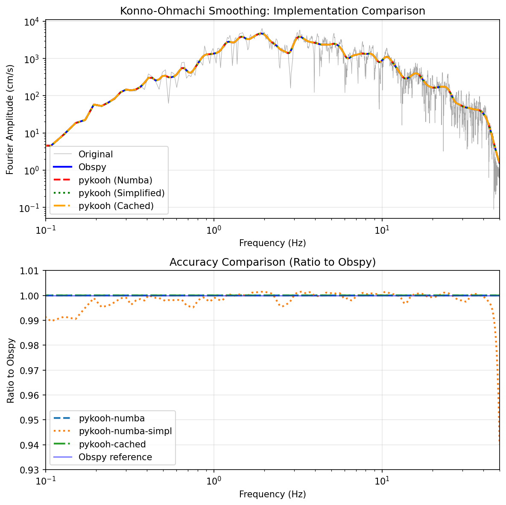

# pykooh

[](https://img.shields.io/pypi/v/pykooh.svg)
[](https://github.com/arkottke/pykooh/actions/workflows/python-app.yml)
[](https://www.codacy.com/manual/arkottke/pykooh)
[](https://www.codacy.com/manual/arkottke/pykooh)

[](https://zenodo.org/badge/latestdoi/183696586)

Konno Ohmachi filter implemented in Numba.

This code implements Konno-Ohmachi spectral smoothing as defined in:

    Konno, K. and Ohmachi, T., 1998. Ground-motion characteristics estimated
    from spectral ratio between horizontal and vertical components of
    microtremor. Bulletin of the Seismological Society of America, 88(1),
    pp.228-241.

This code was originally written for smoothing submodule in
[gmprocess](https://github.com/usgs/groundmotion-processing/tree/master/gmprocess/smoothing)
by Bruce Worden. Dave Boore has provided
[notes](http://daveboore.com/daves_notes/notes%20on%20smoothing%20over%20logarithmically%20spaced%20freqs.pdf)
on this topic, which also may be of interest. Notes regarding the
characteristics of the Konno-Ohmachi filter and the implementation are
provided in the [implementation](implemenation.ipynb) Jupyter Notebook.

# Installation

`pykooh` is available via `pip` and can be installed with:

    pip install pykooh

`pykooh` uses `numba` for fast implementation of the filter.

## Implementation Notes

Previous versions of `pykooh` supported both Numba and Cython implementations.
Testing showed that both implementations provided similar calculation speeds,
but Cython required significantly more effort for packaging and distribution.
Therefore, Cython support has been removed in favor of the Numba-only
implementation which provides excellent performance with much simpler packaging.

# Usage

Two primary approaches for using this library. Smooth a signal using a bandwidth of 30.

```python
import pykooh
signal_smooth = pykooh.smooth(freqs, freqs_raw, signal_raw, 30)
```

If you are okay with a little bit of inaccuracy, you can pass `simplified=True`
and have a 10x increase in speed. In other instances, where the smoothing is
repeated applied, it might make more sense to use the `CachedSmoother`. This
pre-computes the weights and then applies them with `np.dot`.

```python
import pykooh

smoother = CachedSmoother(freqs_raw, freqs, 30)

signal_smooth = smoother(signal_raw)
```

By default, all of the smoothing functions normalize that weights, which is
different than the default behavior of `obspy`. By normalizing the weights, the
amplitude of the FAS is perserved regardless of spacing of the frequency values.
Comparison of the smoothing provided by `pykooh` is compared with that of
`obspy` in the following figure. The simplified numba routine results in some
minor reduction in accuracy.



Additional examples and comparison with `obspy` are provided in
[example](example.ipynb).

# Citation

Please cite this software using the following
[DOI](https://zenodo.org/badge/latestdoi/183696586).

```
Albert Kottke. (2025). arkottke/pykooh (v0.5.0). Zenodo. https://doi.org/10.5281/zenodo.15499453
```
